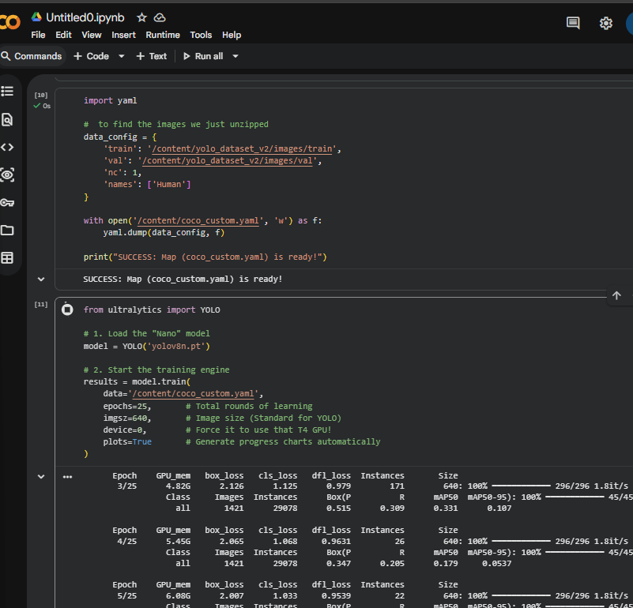

# Custom Human Detection

This section documents the workflow used for training a custom YOLOv8 human detection model using the VisDrone dataset.

The focus was on understanding the complete training pipeline rather than only running inference.

---

# Model Used

- YOLOv8n (Ultralytics)
- Single-class human detection

---

# Training Workflow

- Prepared VisDrone dataset in YOLO format
- Configured dataset YAML files
- Loaded pre-trained YOLOv8n weights
- Trained model using Google Colab T4 GPU
- Ran approximately 25 training epochs

---

# Hardware Workflow

Initial testing was performed locally on:
- Intel i7 11th Gen system
- 4GB GPU

Heavy training workloads were later shifted to:
- Google Colab T4 GPU

---

# Technical Observations

During training and validation:
- observed mAP metrics
- analyzed loss graphs
- explored YOLO training result folders
- monitored drone-view detection behavior

Common challenges noticed:
- tiny object detection difficulty
- dense crowd scenes
- background confusion cases

---

# Training & YAML snippet

```python
from ultralytics import YOLO
model = YOLO('yolov8n.pt')

#TRAIN
results = model.train(
    data='/content/coco_custom.yaml',
    epochs=25,       # Total rounds of learning
    imgsz=640,       # Image size
    device=0,        # T4 GPU
    plots=True       # Charts
)
```
```python
import yaml

#  to find the images we just unzipped
data_config = {
    'train': '/content/yolo_dataset_v2/images/train',
    'val': '/content/yolo_dataset_v2/images/val',
    'nc': 1,
    'names': ['Human']
}

with open('/content/coco_custom.yaml', 'w') as f:
    yaml.dump(data_config, f)

print("SUCCESS: Map (coco_custom.yaml) is ready!")
```


---

# Learning Outcome

This phase helped me understand:
- custom model training
- dataset configuration
- GPU-based workflows
- training/validation pipelines
- real-world object detection challenges

It marked my transition from basic image processing into practical Computer Vision model development.

# Colab Training


