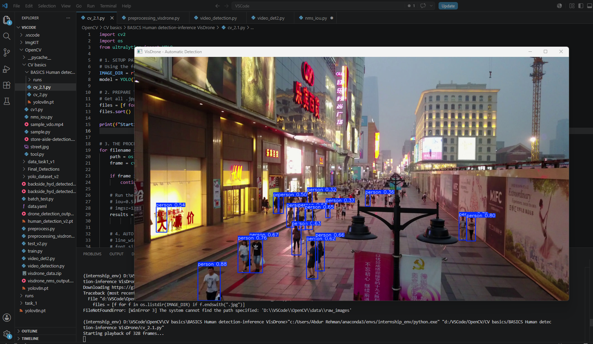

# YOLOv8 Inference

This section contains my initial experiments with YOLOv8 object detection using pre-trained models.

The goal was to understand how inference works on images and videos before moving into custom model training.

---

# Work Done

- Loaded pre-trained `yolov8n.pt`
- Ran detection on static images
- Tested inference on video files
- Detected humans in store aisle recordings
- Observed confidence scores and bounding boxes
- Built custom OpenCV drawing pipelines

---

# Topics Explored

- Bounding boxes
- Confidence thresholds
- Class labels
- Frame-by-frame inference
- Real-time video processing
- Custom rectangle rendering using OpenCV

---

# Sample Detection Workflow

```python
from ultralytics import YOLO

model = YOLO("yolov8n.pt")

results = model(frame)

for box in results[0].boxes:
    print(box.xyxy)
```

---

# Learning Outcome

This phase helped me understand:
- how YOLO inference pipelines work
- how detections are returned by the model
- object localization basics
- video processing workflows using OpenCV
- Workspace Cleanliness: Managed paths cleanly using strict local project path mappings.

It also prepared me for custom dataset training in later stages.

# Sample Output


